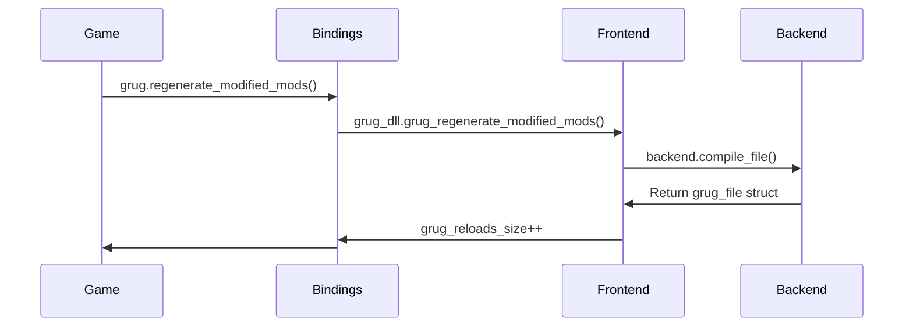
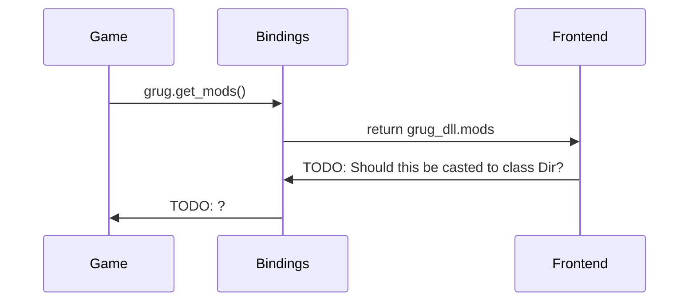

# Swappable grug backend

## Running the program

1. Clone the repository to your machine.
2. Open either the `c` or `python` directory in VS Code, depending on which implementation you want to run.
3. Press **F5** to start the program.

   * If you want to switch backends, open the **Run and Debug** panel in VS Code and change the launch configuration from **Interpreter backend** to **Native backend**.

## Explanation

